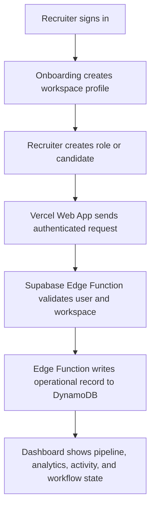

# Jobraker Recruiter

**DynamoDB-first recruiting workspace for lean hiring teams.**

Jobraker Recruiter turns hiring intent into a live recruiter operating system: roles, candidates, sourcing work, pipeline movement, analytics, audit trails, and background workflow state. This Vercel deployment is authenticated through Supabase and designed around Amazon DynamoDB as the primary operational database for recruiter activity.

Live app: https://jobraker-recruiter.vercel.app

---

## Table of Contents

1. [Inspiration](#inspiration)
2. [Problem to Solve](#problem-to-solve)
3. [Our Solution](#our-solution)
4. [DynamoDB-First Architecture](#dynamodb-first-architecture)
5. [Key Features](#key-features)
6. [Typical Workflow](#typical-workflow)
7. [Application Stack](#application-stack)
8. [Security Model](#security-model)
9. [Local Development](#local-development)
10. [Deployment](#deployment)
11. [Project Structure](#project-structure)
12. [Team](#team)

---

## Inspiration

Someone can spend years building hiring intuition: who fits a seed-stage team, how to read a portfolio, what makes outreach feel human, which signals matter for a founding engineer versus a senior product hire. They know the roles they need to fill, the candidates they want to reach, the follow-ups that should have gone out last week, and the story they want every hire to understand about the company.

But then the work gets scattered across tabs, inboxes, spreadsheets, calendars, notes, and ATS tools that were not designed for a small team moving fast.

Jobraker Recruiter brings that hiring intuition into a workspace where every recruiting action becomes structured, inspectable, and durable. The goal is not only to make the recruiter faster. The goal is to make the recruiting system remember.

---

## Problem to Solve

Lean hiring teams face the same recruiting complexity as larger companies, but without the recruiting operations team, data engineering staff, or expensive enterprise ATS stack.

Common pain points:

- Candidate context is fragmented across LinkedIn, email, notes, and spreadsheets.
- Pipeline state is easy to lose and hard to audit.
- Follow-ups and background tasks depend on human memory.
- AI tools often answer questions but do not leave durable recruiting records behind.
- Small teams need infrastructure that can scale without forcing a heavyweight backend.

Jobraker Recruiter solves this by combining a recruiter dashboard with a DynamoDB-backed operational data model, so activity streams, audit trails, and workflow state are treated as first-class product data.

---

## Our Solution

Jobraker Recruiter is a Vercel-hosted recruiter dashboard for sourcing, screening, managing roles, moving candidates through a pipeline, and tracking hiring activity.

The Electron desktop app proved the recruiter experience. The web version brings that experience to the browser and adapts the backend for cloud deployment:

- Vercel hosts the React + Vite web app.
- Supabase handles authentication and secure Edge Function execution.
- Amazon DynamoDB stores recruiter operating records, activity streams, audit trails, and workflow state.
- The browser never talks directly to AWS.

---

## DynamoDB-First Architecture

Amazon DynamoDB is the primary operational database layer for the web app. It is used for the data that benefits most from high-scale key-value access, event ordering, and durable workflow state.

Core DynamoDB record families:

| Record family | Partition key | Sort key | Purpose |
| --- | --- | --- | --- |
| RecruiterCore | `WORKSPACE#id` | `ROLE#id` / `CANDIDATE#id` | Roles, candidates, and pipeline records |
| ActivityStream | `WORKSPACE#id` | `ACTIVITY#time#id` | Recruiter activity feed and dashboard history |
| AuditTrail | `WORKSPACE#id` | `AUDIT#time#id` | Compliance-friendly change history |
| WorkflowState | `WORKSPACE#id` | `WORKFLOW_STATE#type#id` | Background tasks, agents, queues, and job state |

The DynamoDB table is configured from the web app settings screen. The required table shape is:

- Partition key: `pk`
- Sort key: `sk`

Architecture diagram:

[docs/jobraker-recruiter-dynamodb-architecture.png](docs/jobraker-recruiter-dynamodb-architecture.png)

---

## Key Features

- **Landing and Auth Flow**: Public landing page, login, signup, forgot password, reset password, and protected dashboard redirects.
- **Advanced Onboarding**: Recruiter onboarding flow adapted from the main Jobraker product experience.
- **Recruiter Dashboard**: Roles, sourcing, candidates, pipeline, analytics, and settings.
- **Responsive UI**: Desktop dashboard plus tablet/mobile layouts with bottom navigation.
- **DynamoDB Activity Streams**: Candidate, role, interview, and pipeline actions can emit operational events.
- **Audit Trails**: Important recruiter changes are mirrored as audit records.
- **Background Workflow State**: Background task create, patch, run, stop, and delete actions can persist workflow state.
- **Secure API Layer**: Supabase Edge Functions replace local desktop API calls for the web deployment.
- **Connector Settings**: API keys and DynamoDB settings are configured through the app rather than hardcoded in the frontend.

---

## Typical Workflow



Example flow:

1. A recruiter signs in with Supabase Auth.
2. The web app loads the protected recruiter dashboard.
3. The recruiter creates a role, adds candidates, schedules interviews, or moves a candidate through the pipeline.
4. The app records the action through Supabase Edge Functions.
5. DynamoDB stores the operational record for activity streams, audit history, or workflow state.

---

## Application Stack

### Frontend

- React 19
- TypeScript
- Vite
- Tailwind CSS
- Radix UI
- Motion
- Recharts

### Hosting

- Vercel static web deployment
- Root directory: `web`
- Build command: `npm run build`
- Output directory: `dist`
- SPA rewrites through `vercel.json`

### Backend and Data

- Supabase Auth
- Supabase Edge Functions
- Supabase Postgres for auth-adjacent profile/workspace metadata and configuration
- Amazon DynamoDB for recruiter operational data, activity streams, audit trails, and workflow state

### Edge Functions

Current Supabase Edge Functions:

- `aws-dynamodb`
- `background-tasks`
- `chat-runs`
- `workspace-files`
- `workspace-search`
- `recruiter-ai`
- `app-status`

---

## Security Model

The browser does not receive AWS credentials and does not call DynamoDB directly.

Security flow:

1. The user signs in through Supabase Auth.
2. The frontend sends requests with the user's Supabase session.
3. Supabase Edge Functions validate the user and workspace.
4. Edge Functions use server-side credentials to call DynamoDB.
5. DynamoDB IAM access should be scoped to the application table.

This keeps the AWS access path server-side while still allowing the web app to use DynamoDB as the primary operational database.

---

## Local Development

### Prerequisites

- Node.js 20+
- npm
- Supabase project
- DynamoDB table with `pk` and `sk` keys

### Setup

```bash
cd web
npm install
```

Create `.env.local`:

```bash
VITE_SUPABASE_URL=https://kazdiejpfujhudqucaaw.supabase.co
VITE_SUPABASE_PUBLISHABLE_KEY=your_supabase_publishable_key
```

Start the web app:

```bash
npm run dev
```

Build for production:

```bash
npm run build
```

Run linting:

```bash
npm run lint
```

---

## Deployment

### Vercel

The app is deployed from the monorepo with:

- Root directory: `web`
- Install command: `npm ci --legacy-peer-deps`
- Build command: `npm run build`
- Output directory: `dist`

The current production URL is:

https://jobraker-recruiter.vercel.app

### Supabase Edge Functions

Deploy functions from:

```bash
cd backend/supabase
npx supabase functions deploy aws-dynamodb
npx supabase functions deploy background-tasks
npx supabase functions deploy chat-runs
npx supabase functions deploy workspace-files
npx supabase functions deploy workspace-search
npx supabase functions deploy recruiter-ai
npx supabase functions deploy app-status
```

---

## Project Structure

```text
backend/
  supabase/
    functions/       Supabase Edge Functions
    migrations/      Auth, workspace, RLS, and DynamoDB connection schema
docs/                Architecture and submission assets
public/              Static assets
src/                 React web app
vercel.json          Vercel SPA deployment config
```

---

## Team

Miles - product design, AI workflow architecture, DynamoDB-first web architecture, Vercel deployment, Supabase Edge Functions, recruiter UX, and demo preparation.
