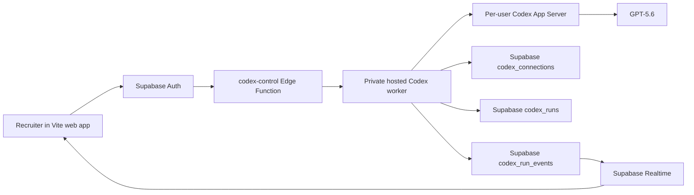
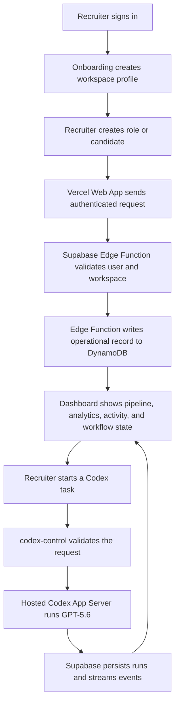

# Jobraker Recruiter

**DynamoDB-first recruiting workspace for lean hiring teams.**

Jobraker Recruiter turns hiring intent into a live recruiter operating system: roles, candidates, sourcing work, pipeline movement, analytics, audit trails, and background workflow state. This Vercel deployment is authenticated through Supabase and designed around Amazon DynamoDB as the primary operational database for recruiter activity.

Live app: https://jobraker-recruiter.vercel.app

> **OpenAI Build Week 2026 extension:** Jobraker Recruiter was meaningfully extended with a browser-compatible Codex App Server architecture, ChatGPT device-code authentication, GPT-5.6 task execution, Supabase-backed run persistence, and Realtime progress events. The existing recruiter product, Supabase architecture, and DynamoDB integration remain intact.

---

## Table of Contents

1. [Inspiration](#inspiration)
2. [Problem to Solve](#problem-to-solve)
3. [Our Solution](#our-solution)
4. [OpenAI Build Week Extension](#openai-build-week-extension)
5. [How Codex and GPT-5.6 Were Used](#how-codex-and-gpt-56-were-used)
6. [Codex App Server Architecture](#codex-app-server-architecture)
7. [Judge Testing Path](#judge-testing-path)
8. [DynamoDB-First Architecture](#dynamodb-first-architecture)
9. [Key Features](#key-features)
10. [Typical Workflow](#typical-workflow)
11. [Application Stack](#application-stack)
12. [Security Model](#security-model)
13. [Local Development](#local-development)
14. [Deployment](#deployment)
15. [Project Structure](#project-structure)
16. [Team](#team)

---

## Inspiration

Someone can spend years building hiring intuition: who fits a seed-stage team, how to read a portfolio, what makes outreach feel human, which signals matter for a founding engineer versus a senior product hire. They know the roles they need to fill, the candidates they want to reach, the follow-ups that should have gone out last week, and the story they want every hire to understand about the company.

But then the work gets scattered across tabs, inboxes, spreadsheets, calendars, notes, and ATS tools that were not designed for a small team moving fast.

Jobraker Recruiter brings that hiring intuition into a workspace where every recruiting action becomes structured, inspectable, and durable. The goal is not only to make the recruiter faster. The goal is to make the recruiting system remember.

---

## Problem to Solve

Lean hiring teams face the same recruiting complexity as larger companies, but without the recruiting operations team, data engineering staff, or expensive enterprise ATS stack.

Common pain points:

- Candidate context is fragmented across LinkedIn, email, notes, and spreadsheets.
- Pipeline state is easy to lose and hard to audit.
- Follow-ups and background tasks depend on human memory.
- AI tools often answer questions but do not leave durable recruiting records behind.
- Small teams need infrastructure that can scale without forcing a heavyweight backend.

Jobraker Recruiter solves this by combining a recruiter dashboard with a DynamoDB-backed operational data model, so activity streams, audit trails, and workflow state are treated as first-class product data.

---

## Our Solution

Jobraker Recruiter is a Vercel-hosted recruiter dashboard for sourcing, screening, managing roles, moving candidates through a pipeline, and tracking hiring activity.

The Electron desktop app proved the recruiter experience. The web version brings that experience to the browser and adapts the backend for cloud deployment:

- Vercel hosts the React + Vite web app.
- Supabase handles authentication and secure Edge Function execution.
- Amazon DynamoDB stores recruiter operating records, activity streams, audit trails, and workflow state.
- OpenAI Codex provides a task-execution layer that can operate through a hosted App Server instead of a browser-local CLI process.
- GPT-5.6 is the default Codex model for recruiter workflow runs.
- The browser never talks directly to AWS or stores ChatGPT credentials.

---

## OpenAI Build Week Extension

Jobraker Recruiter existed before OpenAI Build Week. During the official submission period, it was meaningfully extended using Codex and GPT-5.6.

The main Build Week change was replacing a local, browser-adjacent Codex gateway assumption with a hosted, authenticated architecture suitable for a real Vite web application.

The extension adds:

- **Hosted Codex App Server worker** — a persistent private service runs Codex App Server outside the browser.
- **ChatGPT device-code authentication** — recruiters can start a ChatGPT sign-in flow from the Jobraker settings interface.
- **GPT-5.6 model selection** — the Codex task interface defaults to `gpt-5.6`.
- **Supabase control plane** — an authenticated `codex-control` Edge Function validates the recruiter and forwards approved actions to the worker.
- **Per-user runtime isolation** — the worker maintains a separate Codex runtime and `CODEX_HOME` for each authenticated user.
- **Durable run state** — Codex connections, runs, outputs, errors, thread IDs, and turn IDs are persisted in Supabase.
- **Realtime execution progress** — the browser subscribes to ordered run events and displays queued, thinking, executing, completed, failed, and cancelled states.
- **Reconnect-safe history** — saved events allow the interface to reload current output after a refresh or reconnection.
- **Command and file-change visibility** — the UI surfaces when Codex starts commands or applies workspace file changes.
- **Cancellation and continuation** — recruiters can stop a running task or continue using the current Codex thread.

This work extended the AI execution layer without replacing the existing dashboard, candidate pages, sourcing workflows, pipeline, analytics, Supabase authentication, or DynamoDB integration.

### Build Week evidence

Representative commits created during the Build Week submission period include:

- [`04c46ec`](https://github.com/mylife-as-miles/Jobraker-Recruiter/commit/04c46ecf3884f331cd32c3dba0f59fcf43ee712d) — add the RLS-protected Codex runtime schema.
- [`966c9ac`](https://github.com/mylife-as-miles/Jobraker-Recruiter/commit/966c9ac4450eca265c2b2ffd8a72e9f7c8682afd) — add the hosted per-user Codex App Server worker.
- [`5863250`](https://github.com/mylife-as-miles/Jobraker-Recruiter/commit/58632500beec8719e3f13b9f024fc8049fe7313b) — route Codex settings through Supabase and Realtime.
- [`1e8d3db`](https://github.com/mylife-as-miles/Jobraker-Recruiter/commit/1e8d3db7b4768f625e2ea03aceeab0dd9b4bb082) — remove the browser-local Codex gateway.
- [`23882ec`](https://github.com/mylife-as-miles/Jobraker-Recruiter/commit/23882ec0254d9cee2384365acc6266d03570a069) — validate the Vite app and Codex worker.
- [`3f3c857`](https://github.com/mylife-as-miles/Jobraker-Recruiter/commit/3f3c857d2b3b44caba2ef935f8c48c4cc9dfaf0b) — merge the hosted Supabase Codex flow.
- [`7daf5b9`](https://github.com/mylife-as-miles/Jobraker-Recruiter/commit/7daf5b9a0739e1ca7aa91851c0fe903a9dae9bc3) — improve the Codex worker setup and error state.

---

## How Codex and GPT-5.6 Were Used

Codex was used as an engineering collaborator throughout the Build Week extension, not only to generate isolated snippets.

### 1. Architecture audit

Codex reviewed the existing Vite, Supabase, and recruiter settings architecture and identified the central limitation: a browser application cannot safely start, authenticate, or manage a local Codex CLI process for every user.

It helped trace the impact of that limitation across:

- browser security
- ChatGPT authentication
- user and workspace ownership
- persistent conversations
- background execution
- Vercel deployment
- Supabase Edge Functions
- Realtime updates
- worker packaging

### 2. Architecture design

GPT-5.6, through Codex, helped compare implementation options and design the final separation of responsibilities:

- the **Vite application** owns the recruiter interface;
- **Supabase Auth** owns application identity;
- the **`codex-control` Edge Function** authenticates and authorizes browser requests;
- the **hosted worker** owns the persistent Codex App Server process;
- **Supabase Postgres and Realtime** persist and stream connection, run, and event state;
- the worker's per-user **`CODEX_HOME`** stores ChatGPT authentication material outside the browser and database.

The final product and security decisions were made by Miles. Codex accelerated analysis, implementation, debugging, and review.

### 3. Implementation

Codex helped implement and revise:

- the `codex_connections`, `codex_runs`, and `codex_run_events` database schema;
- row-level security policies scoped to the authenticated user;
- ordered Realtime event delivery;
- the authenticated Supabase `codex-control` Edge Function;
- the hosted `services/codex-worker` runtime;
- device-code ChatGPT authentication;
- start, continue, cancel, logout, and status actions;
- GPT-5.6 model selection;
- the Codex settings interface;
- reconnect-safe output replay;
- worker health and configuration errors;
- Vercel-safe separation between the web app and worker package.

### 4. Debugging and validation

Codex was also used to diagnose and fix integration problems involving:

- worker packaging being incorrectly detected as part of the Vite deployment;
- package-lock compatibility for Vercel;
- worker runtime prerequisites;
- Supabase secret configuration;
- Realtime ownership and foreign-key indexes;
- unavailable-worker states in the settings UI;
- build and validation scripts for the web app and worker.

### 5. Human judgment and product direction

Codex did not decide the product direction independently.

Human decisions included:

- preserving the existing Jobraker Recruiter UI instead of generating a replacement interface;
- keeping Supabase as the authenticated source of truth;
- retaining DynamoDB for operational recruiter workloads;
- using a hosted App Server architecture rather than exposing a local CLI requirement to recruiters;
- keeping ChatGPT tokens out of Supabase and the browser;
- showing visible task state so recruiters can inspect what Codex is doing;
- adding cancellation, error handling, and reconnect-safe persistence before treating the feature as a production workflow.

---

## Codex App Server Architecture

The Build Week Codex flow is:



### Runtime responsibilities

| Component | Responsibility |
| --- | --- |
| Vite web app | Connect ChatGPT, select a model, submit tasks, show status and output |
| Supabase Auth | Identify the recruiter and protect workspace access |
| `codex-control` Edge Function | Validate the authenticated request and proxy approved worker actions |
| Hosted Codex worker | Manage per-user App Server processes and ChatGPT device authentication |
| Codex App Server | Execute threads, turns, commands, and file changes |
| GPT-5.6 | Default reasoning and execution model for Codex runs |
| Supabase Postgres | Persist connections, runs, outputs, metadata, and ordered events |
| Supabase Realtime | Stream run and event changes to the browser |

### Security boundaries

- ChatGPT authentication tokens are not stored in the browser.
- ChatGPT authentication tokens are not stored in Supabase tables.
- Each authenticated recruiter can read only their own Codex connection, run, and event rows through RLS.
- Browser requests must pass through Supabase authentication before reaching the worker.
- The worker requires a server-only shared secret.
- The worker uses a server-only Supabase key for controlled persistence.
- AWS credentials remain behind Supabase Edge Functions and are unrelated to the Codex authentication path.

### Important implementation files

| Area | File |
| --- | --- |
| Codex settings UI | `src/components/settings/codex-app-server-settings.tsx` |
| Settings integration | `src/components/settings-dialog.tsx` |
| Authenticated control function | `backend/supabase/functions/codex-control/index.ts` |
| Hosted worker | `services/codex-worker/server.mjs` |
| Worker package | `services/codex-worker/package.json` |
| Worker container | `services/codex-worker/Dockerfile` |
| Supabase runtime schema | `backend/supabase/migrations/20260721210000_create_codex_web_runtime.sql` |

---

## Judge Testing Path

The production deployment is the primary no-rebuild testing path:

**https://jobraker-recruiter.vercel.app**

1. Open the live application.
2. Create an account or sign in.
3. Complete the recruiter onboarding flow if prompted.
4. Open **Settings**.
5. Select the **Codex App Server** integration.
6. Choose **Connect ChatGPT**.
7. Complete the device-code sign-in in the opened browser window.
8. Return to Jobraker Recruiter and confirm that the connection state becomes **Connected**.
9. Keep `GPT-5.6` selected.
10. Enter a recruiter workflow task, such as:

```text
Review this recruiter workspace, identify the highest-priority open role,
propose a sourcing and outreach plan, and summarize the next actions.
```

11. Start the run and observe the queued, thinking, executing, and completed states.
12. Review the persisted output and visible command or file-change events.
13. Refresh the page to confirm that the run and output can be loaded again.
14. Start a follow-up task to continue the current Codex thread.
15. Use the stop control to test cancellation on a running task.

The hosted worker and its required Supabase secrets must remain configured during the judging period. Setup details are included below for repository-level verification.

---

## DynamoDB-First Architecture

Amazon DynamoDB is the primary operational database layer for the web app. It is used for the data that benefits most from high-scale key-value access, event ordering, and durable workflow state.

Core DynamoDB record families:

| Record family | Partition key | Sort key | Purpose |
| --- | --- | --- | --- |
| RecruiterCore | `WORKSPACE#id` | `ROLE#id` / `CANDIDATE#id` | Roles, candidates, and pipeline records |
| ActivityStream | `WORKSPACE#id` | `ACTIVITY#time#id` | Recruiter activity feed and dashboard history |
| AuditTrail | `WORKSPACE#id` | `AUDIT#time#id` | Compliance-friendly change history |
| WorkflowState | `WORKSPACE#id` | `WORKFLOW_STATE#type#id` | Background tasks, agents, queues, and job state |

The DynamoDB table is configured from the web app settings screen. The required table shape is:

- Partition key: `pk`
- Sort key: `sk`

Architecture diagram:

[docs/jobraker-recruiter-dynamodb-architecture.png](docs/jobraker-recruiter-dynamodb-architecture.png)

---

## Key Features

- **Landing and Auth Flow**: Public landing page, login, signup, forgot password, reset password, and protected dashboard redirects.
- **Advanced Onboarding**: Recruiter onboarding flow adapted from the main Jobraker product experience.
- **Recruiter Dashboard**: Roles, sourcing, candidates, pipeline, analytics, and settings.
- **Responsive UI**: Desktop dashboard plus tablet/mobile layouts with bottom navigation.
- **Codex App Server Integration**: Hosted, authenticated Codex execution for browser-based recruiter tasks.
- **GPT-5.6 Task Runs**: Model selection, thread continuation, cancellation, persisted output, and Realtime progress.
- **DynamoDB Activity Streams**: Candidate, role, interview, and pipeline actions can emit operational events.
- **Audit Trails**: Important recruiter changes are mirrored as audit records.
- **Background Workflow State**: Background task create, patch, run, stop, and delete actions can persist workflow state.
- **Secure API Layer**: Supabase Edge Functions replace local desktop API calls for the web deployment.
- **Connector Settings**: API keys, Codex, and DynamoDB settings are configured through the app rather than hardcoded in the frontend.

---

## Typical Workflow



Example flow:

1. A recruiter signs in with Supabase Auth.
2. The web app loads the protected recruiter dashboard.
3. The recruiter creates a role, adds candidates, schedules interviews, or moves a candidate through the pipeline.
4. The app records the action through Supabase Edge Functions.
5. DynamoDB stores the operational record for activity streams, audit history, or workflow state.
6. The recruiter connects ChatGPT from the Codex settings panel.
7. The recruiter sends a workflow task using GPT-5.6.
8. The hosted Codex worker executes the task and writes ordered progress events to Supabase.
9. The dashboard shows the saved result and allows the recruiter to continue or cancel the run.

---

## Application Stack

### Frontend

- React 19
- TypeScript
- Vite
- Tailwind CSS
- Radix UI
- Motion
- Recharts

### AI and Agent Runtime

- OpenAI Codex
- GPT-5.6
- Codex App Server
- ChatGPT device-code authentication
- Supabase Realtime
- Hosted Node.js Codex worker

### Hosting

- Vercel static web deployment
- Root directory: `web`
- Build command: `npm run build`
- Output directory: `dist`
- SPA rewrites through `vercel.json`

### Backend and Data

- Supabase Auth
- Supabase Edge Functions
- Supabase Postgres for auth-adjacent profile/workspace metadata, Codex run persistence, and configuration
- Amazon DynamoDB for recruiter operational data, activity streams, audit trails, and workflow state

### Edge Functions

Current Supabase Edge Functions:

- `aws-dynamodb`
- `background-tasks`
- `chat-runs`
- `workspace-files`
- `workspace-search`
- `recruiter-ai`
- `app-status`
- `codex-control`

---

## Security Model

The browser does not receive AWS credentials, ChatGPT tokens, worker secrets, or direct DynamoDB access.

Security flow:

1. The user signs in through Supabase Auth.
2. The frontend sends requests with the user's Supabase session.
3. Supabase Edge Functions validate the user and workspace.
4. The `codex-control` function forwards authorized Codex actions to the private worker.
5. The worker stores ChatGPT authentication inside the user's isolated `CODEX_HOME`.
6. The worker persists safe connection, run, and event metadata to Supabase.
7. RLS allows the browser to read only rows owned by the authenticated user.
8. Other Edge Functions use server-side credentials to call DynamoDB.
9. DynamoDB IAM access should be scoped to the application table.

This keeps AWS and Codex privileged access server-side while still allowing the web app to provide a browser-native recruiter experience.

---

## Local Development

### Prerequisites

- Node.js 20+
- npm
- Supabase project
- DynamoDB table with `pk` and `sk` keys
- A separately deployed Codex worker for hosted Codex functionality
- Codex installed inside the worker environment

### Setup

```bash
npm install
```

Create `.env.local`:

```bash
VITE_SUPABASE_URL=https://kazdiejpfujhudqucaaw.supabase.co
VITE_SUPABASE_PUBLISHABLE_KEY=your_supabase_publishable_key
```

Start the web app:

```bash
npm run dev
```

Build for production:

```bash
npm run build
```

Run linting:

```bash
npm run lint
```

### Hosted Codex worker

Install the worker package:

```bash
cd services/codex-worker
npm install
```

Configure the worker with server-only environment variables:

```bash
PORT=8787
JOBRAKER_CODEX_WORKER_SECRET=your-shared-secret
SUPABASE_URL=https://your-project.supabase.co
SUPABASE_SERVICE_ROLE_KEY=your-server-only-key
CODEX_STATE_DIR=/persistent/codex-state
CODEX_WORKSPACE_ROOT=/persistent/workspaces
```

Start the worker:

```bash
npm start
```

The worker environment must also contain a working Codex installation that supports App Server and ChatGPT device-code authentication.

---

## Deployment

### Vercel

The app is deployed from the monorepo with:

- Root directory: project root
- Install command: `npm ci --legacy-peer-deps`
- Build command: `npm run build`
- Output directory: `dist`

The current production URL is:

https://jobraker-recruiter.vercel.app

### Supabase Edge Functions

Deploy functions from:

```bash
cd backend/supabase
npx supabase functions deploy aws-dynamodb
npx supabase functions deploy background-tasks
npx supabase functions deploy chat-runs
npx supabase functions deploy workspace-files
npx supabase functions deploy workspace-search
npx supabase functions deploy recruiter-ai
npx supabase functions deploy app-status
npx supabase functions deploy codex-control
```

Apply the Codex runtime migration:

```bash
npx supabase db push
```

The Codex settings screen requires a persistent private worker before ChatGPT and Codex can connect:

```bash
supabase secrets set --project-ref kazdiejpfujhudqucaaw \
  CODEX_WORKER_URL=https://your-worker-host \
  CODEX_WORKER_SECRET=your-shared-secret
```

The worker in `services/codex-worker` must be deployed separately with the same `JOBRAKER_CODEX_WORKER_SECRET`, plus `SUPABASE_URL` and a server-only Supabase key.

---

## Project Structure

```text
backend/
  supabase/
    functions/
      codex-control/  Authenticated Codex worker control plane
    migrations/       Auth, workspace, RLS, DynamoDB, and Codex runtime schema
docs/                  Architecture and submission assets
public/                Static assets
services/
  codex-worker/        Persistent hosted Codex App Server worker
src/
  components/settings/ Codex and integration settings UI
  ...                  React web app
vercel.json             Vercel SPA deployment config
```

---

## Team

**Miles — solo builder**

Responsibilities:

- product design
- recruiter workflow architecture
- AI and Codex architecture
- React and Vite web implementation
- Supabase integration
- AWS DynamoDB integration
- hosted Codex worker integration
- GPT-5.6-assisted engineering
- Vercel deployment
- Supabase Edge Functions
- recruiter UX
- testing and validation
- documentation
- demo preparation
