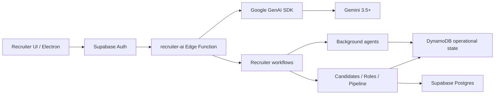

# Jobraker Recruiter

**Agentic recruiting workspace for lean hiring teams.**

Jobraker Recruiter turns hiring intent into structured recruiting operations: roles, candidates, sourcing, screening, pipeline movement, analytics, audit trails, and background workflow state.

The AI layer is powered by **Gemini 3.5+ through Google's `@google/genai` SDK**. Recruiter AI requests execute server-side in a Supabase Edge Function so the Gemini API key never reaches the browser or Electron renderer.

## Core capabilities

- Role and candidate management
- Sourcing and candidate research
- AI-assisted candidate evaluation
- Pipeline and interview workflows
- Background agents and scheduled tasks
- MCP-capable agent definitions
- Agent-as-a-tool composition
- Embedded Electron browser surface
- Workspace files and recruiter knowledge
- DynamoDB operational records and audit state
- Supabase Auth, Postgres, Realtime, Storage, and Edge Functions

## Gemini architecture


```mermaid
graph LR
    A[Recruiter UI / Electron] --> B[Supabase Auth]
    B --> C[recruiter-ai Edge Function]
    C --> D[Google GenAI SDK]
    D --> E[Gemini 3.5+]
    C --> F[Recruiter workflows]
    F --> G[Candidates / Roles / Pipeline]
    F --> H[Background agents]
    G --> I[DynamoDB operational state]
    H --> I
    G --> J[Supabase Postgres]
```

### Runtime contract

The shared recruiter AI channel is:

```text
recruiter:generateLlm
```

It is used by recruiter surfaces such as sourcing and candidate workflows. The server-side implementation lives at:

```text
backend/supabase/functions/recruiter-ai/index.ts
```

The Edge Function imports:

```ts
import { GoogleGenAI } from "npm:@google/genai";
```

Default model:

```text
gemini-3.5-flash
```

Override it with `GEMINI_MODEL`.

## Agent runtime

Jobraker Recruiter includes reusable agent primitives under `src/lib/x-shared`.

### Tool attachments

Agents can attach:

- built-in tools
- MCP tools
- other agents as tools

### Scheduling

Agents support:

- cron schedules
- execution windows
- one-time runs

Background task state is persisted through Supabase and can be mirrored into DynamoDB for operational history.

## Embedded browser

The desktop experience includes an Electron `WebContentsView` browser pane. The renderer owns browser chrome and bounds while the Electron main process owns the actual browsing surface.

This gives recruiter agents a natural path for browser-assisted sourcing and research without exposing privileged credentials to page content.

## Application stack

### Frontend / desktop

- React 19
- TypeScript
- Vite
- Electron-compatible browser surface
- Tailwind CSS
- Radix UI
- Motion
- Recharts

### AI

- Gemini 3.5+
- Google GenAI SDK (`@google/genai`)
- Supabase Edge Functions
- MCP-capable tool definitions
- Background/scheduled agents

### Backend and data

- Supabase Auth
- Supabase Postgres
- Supabase Realtime
- Supabase Storage
- Supabase Edge Functions
- Amazon DynamoDB for operational records, activity, audit, and workflow state

## Gemini configuration

Set these secrets on the Supabase project:

```bash
supabase secrets set \
  GEMINI_API_KEY=your_gemini_api_key \
  GEMINI_MODEL=gemini-3.5-flash
```

`GEMINI_MODEL` is optional; `gemini-3.5-flash` is the server default.

Deploy the AI function:

```bash
cd backend/supabase
npx supabase functions deploy recruiter-ai
```

## Local development

Prerequisites:

- Node.js 20+
- npm
- Supabase project
- DynamoDB table if operational mirroring is enabled
- Gemini API key configured as a Supabase secret

Install and run:

```bash
npm install
npm run dev
```

Build:

```bash
npm run build
```

Lint:

```bash
npm run lint
```

## Supabase functions

Current recruiter backend surfaces include:

- `aws-dynamodb`
- `background-tasks`
- `chat-runs`
- `workspace-files`
- `workspace-search`
- `recruiter-ai`
- `app-status`

## Retired AI runtime

The former hosted Codex App Server, GPT-5.6 execution path, ChatGPT device-code authentication, and private Codex worker have been removed.

Historical database migrations are retained as migration history for existing Supabase environments. The cleanup migration:

```text
backend/supabase/migrations/20260827170000_remove_codex_runtime.sql
```

removes the retired runtime tables from active databases.

## Security

- Gemini credentials are server-side only.
- Browser and Electron renderer code do not receive `GEMINI_API_KEY`.
- Supabase Auth establishes user identity and workspace access.
- Edge Functions enforce authenticated workspace boundaries.
- DynamoDB credentials remain behind server-side functions.
- MCP and background-agent capabilities should be allowlisted and audited.

## Repository structure

```text
backend/
  supabase/
    functions/
      recruiter-ai/      Gemini-backed recruiter AI
      background-tasks/  Background agent state
      aws-dynamodb/      Operational DynamoDB bridge
    migrations/
src/
  components/
    browser-pane/        Electron browser UI
    recruiter/           Recruiter product surfaces
    settings/            Gemini and integration settings
  lib/
    x-shared/            Agent, MCP, scheduling, run schemas
```

## Team

**Miles — solo builder**
